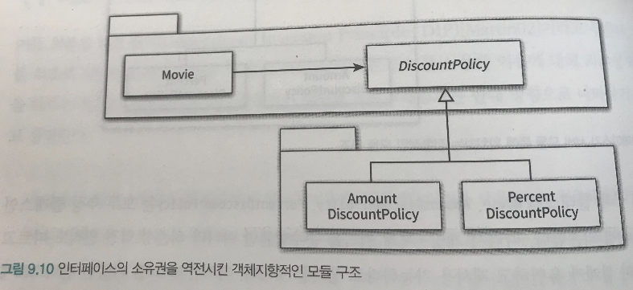

# 9장 유연한 설계

이 장에서 알 수 있는 것들

- 생성 사용 분리
- Pure Fabrication ; Factory의 사용
- 명시적으로 의존성 드러내기 ; 의존성 주입 외 다른 방법의 단점
- 패키지에서 인터페이스 소유권을 어디에 둬야 하는지 ; DIP

# 1 개방 폐쇄 원칙

유연한 설계란 기존의 코드를 수정하지 않고도 애플리케이션의 동작을 확장할 수 있는 설계.

## 컴파일 타임 의존성을 고정시키고 런타임 의존성을 변경해라.

- 컴파일 타임 의존성 : 코드에서 드러나는 클래스들 사이의 관계
- 런타임 의존성 : 실행 시에 협력에 참여하는 객체들의 관계

## 추상화가 핵심이다

변하는 부분은 고정하고 변하지 않는 부분을 생략하는 추상화 메커니즘이 개방-폐쇄 원칙의 기반.

추상화는 설계의 확장을 가능하게 한다.

# 2 생성 사용 분리

동일한 클래스 안에서 객체 생성과 사용이라는 두 가지 이질적인 목적을 가진 코드가 존재하는 것은 문제다!

    public class Movie {
    	...
    	private DiscountPolicy discountPolicy;
    
    	public Movie(String title, Duration runningTime, money fee) {
    		...
    		this.discountPolicy = new AmountDiscountPolicy(..); 
    		//-> 동작 추가, 변경시 기존 코드 수정하게 만든다 ; 개방 폐쇄 위반 ; 동일 클래스 내 객체 생성&사용
    	}
    
    	public Money calculateMovieFee(Screening screening) {
    		return fee.minus(discountPolicy.calculateDiscountAmount(screening));
    	}
    }

해결방법 : 객체 생성할 책임을 클라이언트로 옮긴다. 더 나아가, 클라이언트에서도 생성&사용을 분리하길 원한다면, Factory를 추가하는 방법도 있다.

Client —> Movie —> DiscountPolicy

## 순수한 가공물에게 책임 할당하기

- Pure Fabrication은 기술적인 결정에 의해 생성하는 것으로, 객체 생성 책임을 도메인 개념과는 관련이 없는 가공의 객체에 맡긴다.
- **객체지향이 실세계를 모방해야  한다는 헛된 주장에 현혹되지 말고, 인공적 객체를 추상화해서 사용하자!**
- Factory는 객체 생성 책임을 할당할만한 도메인 객체가 존재하지 않을 때 선택할 수 있는 Pure Fabrication이다.

# 3 의존성 주입

컴파일 타임 의존성과 런타임 의존성의 차이점을 해소하기 위해 여러 방법이 존재하는데, 다음 3가지가 대표적.

- 생성자 주입
- setter 주입
- 메서드 주입

## 숨겨진 의존성은 나쁘다

추천하지 않는 예 : Service Locator 패턴

- 객체가 직접 Service Locator에게 의존성 해결해줄 것을 요청한다.

ex>

    ServiceLocator.provide(new AmountDiscountPolicy(...));  // 인스턴스 등록
    Movie avatar = new Movie("아바타", Duration.ofMinutes(120), Money.wons(10000));
    // Movie 생성자 안에서 this.discountPolicy = ServiceLocator.discountPolicy();로 의존성 해결.

단점 : 의존성을 감춘다

→ 의존성을 구현 내부로 감출 경우 문제를 런타임에 가서야 발견할 수 있다.

- 클래스의 사용법을 익히기 위해 구현 내부를 샅샅이 뒤져야 하는, 클래스의 캡슐화가 무너진 것!
; 좋은 코드는 클래스의 퍼블릭 인터페이스만으로 사용 방법을 이해할 수 있는 코드다!

# 4 의존성 역전 원칙

객체 사이의 협력이 존재할 때 그 협력의 본질을 담고 있는 것은 상위 수준의 정책이다.

- 하위 수준의 변경으로 인해 상위 수준이 변경 되어서는 곤란하다.
- 모두가 추상화에 의존하면 해결 가능하다!

DIP :
1 상위 수준의 모듈은 하위 수준의 모듈에 의존해서는 안된다. 둘 모두 추상화에 의존해야 한다.

2 추상화는 구체적인 사항에 의존해서는 안 된다. 구체적인 사항은 추상화에 의존해야 한다.

## 의존성 역전 원칙과 패키지

역전은 의존성의 방향뿐만 아니라 인터페이스의 소유권에도 적용된다.

- 코드의 컴파일이 성공하기 위해 함께 존재해야 하는 코드를 정의하는 것이 바로 컴파일타임 의존성이다.
- 다음과 같이, 인터페이스의 소유권을 서버가 아닌 클라이언트에 위치시킨다 ; 인터페이스의 소유권 역시 역전.
- 객체지향 패러다임에서는 인터페이스가 상위 수준의 모듈에 속한다.

만약 DiscountPolicy가 하위 패키지에 같이 들어간다면, DiscountPolicy가 속한 패키지 내의 구현체 중 하나가 변경되어도 다 같이 재배포되어야 하며, DiscountPolicy에 의존하는 Movie 패키지도 다시 배포되어야 한다.

# 5 유연성에 대한 조언

## 유연한 설계는 유연성이 필요할 때만 옳다

## 협력과 책임이 중요하다

- 중요한 비즈니스 로직을 처리하기 위해 책임을 할당하고 협력의 균형을 맞추는 것이 객체 생성에 대한 책임을 할당하는 것보다 우선이다. ; 역할, 책임, 협력에 집중하라.
    - 객체를 생성하는 방법에 대한 결정은 모든 책임이 자리를 잡은 후 가장 마지막 시점에 내리는 것이 적절
    - 중요한 관심거리는, 객체들 사이의 관계를 신경 쓰는 것이다!